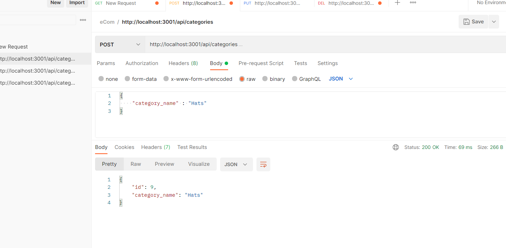
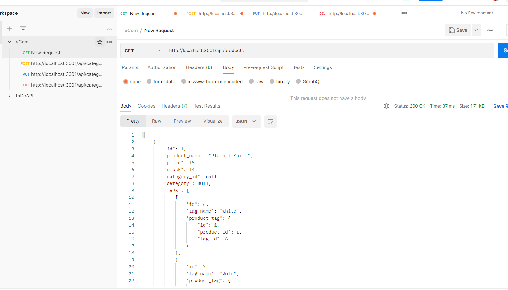

# eCommerceBackEnd

  
#### Table of Contents
* [Project Description](#project-description)
* [Installation Instructions](#installation-instructions)
* [Usage Information](#usage-information)
* [Contributor Guidelines](#contributor-guidelines)
* [Code of Conduct](#code-of-conduct)
* [License](#license)
* [Test Instructions](#test-instructions)
* [Questions](#questions)
* [Video Tutorial](#video-tutorial)
* [Deployment Image](#deployment-image)

## Project Description
* In this project I have built a back end e-commerce site. I have configured a working Express.js API to use Sequelize to interact with a MySQL database alowing a user to check the API using Postman.

## Installation Instructions
* Express
* MySQL
* Sequelize

## Usage Information
* The usage for this project is to build a back end e-commerce site by modifying starter code. By using Postman, you can check to make sure your API is working.

## Contributor Guidelines
* Contribution rules are under the Code of Conduct section

## Code of Conduct
* [Contributor Code of Conduct](https://www.contributor-covenant.org/version/2/0/code_of_conduct/code_of_conduct.md)

## Test Instructions
* No test required

## License
* MIT License

## Questions
* For additional help or questions about collaboration, please reach out to jpodell21@gmail.com
* Follow me on Github at [JamesO1231](http://github.com/JamesO1231)

## Video Tutorial
* [Video Tutorial Link](https://drive.google.com/file/d/1dWJyhzMoTB8QkRQic9tZGnw6KGIO9b6m/view)

## Deployment Image

